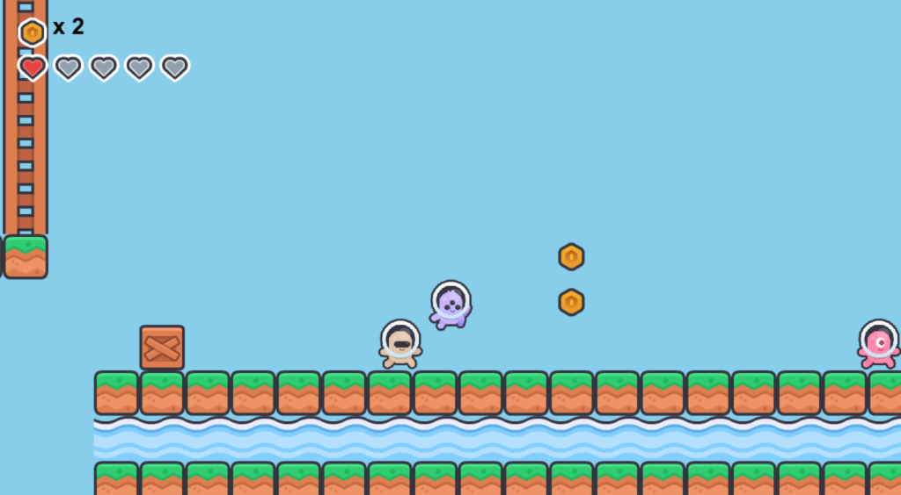

# Gabe Adventure

Welcome to **Gabe Adventure**, a 2D platformer game featuring Gabe, an 11-year-old explorer! Navigate through challenging levels, collect coins, push obstacles, and dodge traps to reach the end of your journey.



## 🎮 Gameplay Features

-   **Dynamic Level Loading**: Levels are parsed directly from a text file (`maps.txt`), allowing for easy editing and expansion.
-   **Character Mechanics**: Gabe can walk, run (Sprint), and jump. He even has a special swimming move when in water!
-   **Health System**: Start with **5 hearts**. Avoid hazards like spikes to stay alive.
-   **Interactive World**:
    -   **Movable Boxes**: Push wooden crates to build stairs or clear your path.
    -   **Spinning Coins**: Collect gold coins scattered throughout the levels.
    -   **Water Zones**: Swim through deep water sections with adjusted physics.
-   **Camera System**: A smooth scrolling camera keeps Gabe centered while respecting level boundaries (no void visible!).
-   **Multi-Level Support**: Complete Level 1 to unlock Level 2 and reach the final victory screen.

## ⌨️ Controls

-   **Left / Right Arrow Keys**: Move Gabe
-   **L-Shift / R-Shift**: Run (Sprint)
-   **Space Bar**: 
    -   Jump (on ground)
    -   Swim Up (in water)
    -   Advance to Next Level (on victory screen)
-   **R Key**: Restart current level (on Game Over)
-   **Esc Key**: Exit Game (on final victory screen)

## 📁 Project Structure

-   `game-gabe-adventure.py`: The main entry point.
-   `game.py`: Manages the game loop, events, and level transitions.
-   `level.py`: Handles level parsing, sprite groups, and collision logic.
-   `player.py`: Contains the logic for Gabe's movement, animations, and health.
-   `settings.py`: Configuration for screen size, physics, and asset paths.
-   `maps.txt`: The level design storage file.

## 🚀 Getting Started

### Prerequisites

-   Python 3.10 or higher
-   [pygame-ce](https://pyga.me/)

### Installation

1.  **Clone the repository** (or navigate to the project folder).
2.  **Create a virtual environment**:
    ```bash
    python3 -m venv venv
    ```
3.  **Activate the environment**:
    -   Mac/Linux: `source venv/bin/activate`
    -   Windows: `venv\Scripts\activate`
4.  **Install dependencies**:
    ```bash
    pip install pygame-ce
    ```

### Running the Game

Simply run the main script:
```bash
python game-gabe-adventure.py
```

To start at a specific level (e.g., Level 2):
```bash
python game-gabe-adventure.py --level 2
```

## 🎨 Assets
The game uses assets from the incredible **Kenney New Platformer Pack**. Check them out at [kenney.nl](https://kenney.nl/assets/new-platformer-pack).
